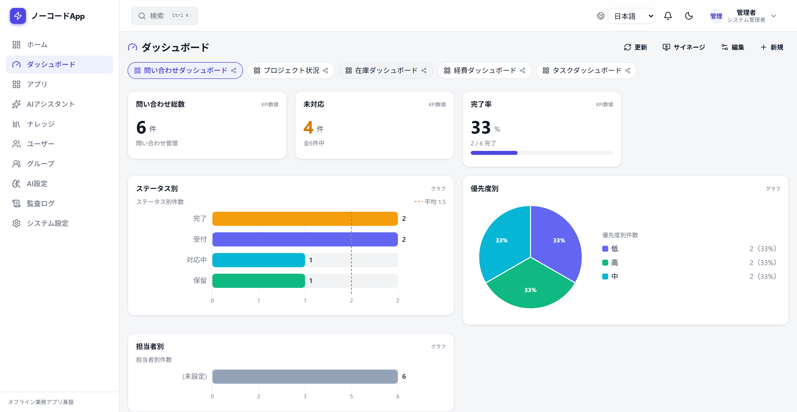
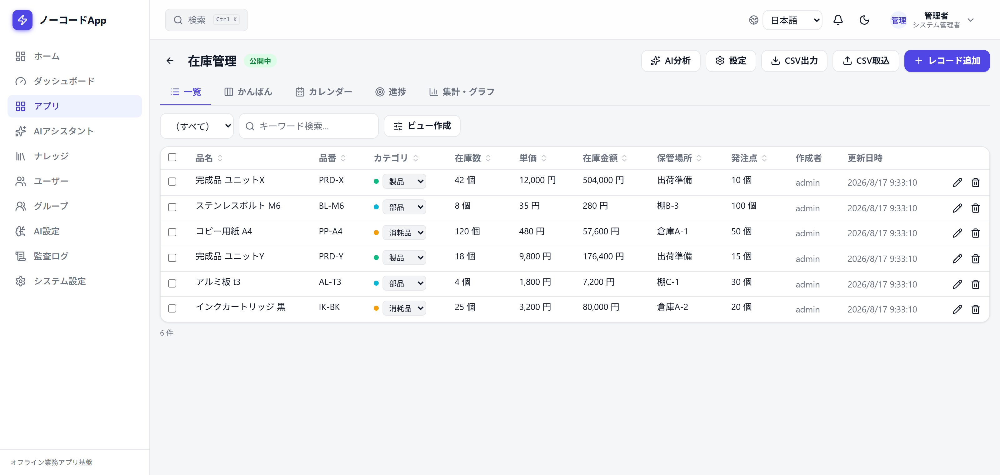
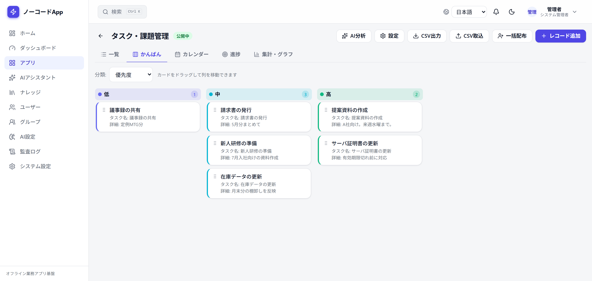
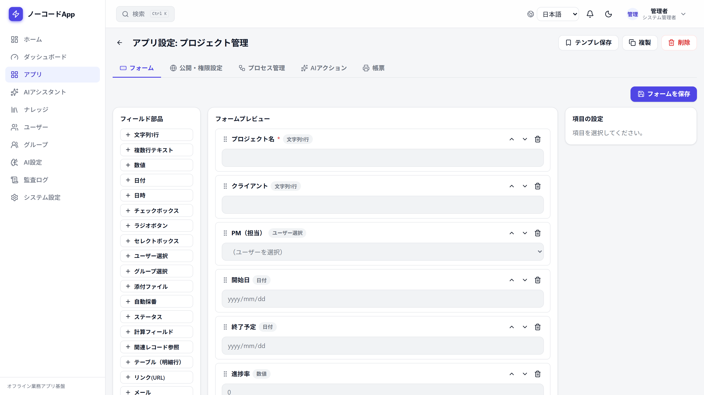
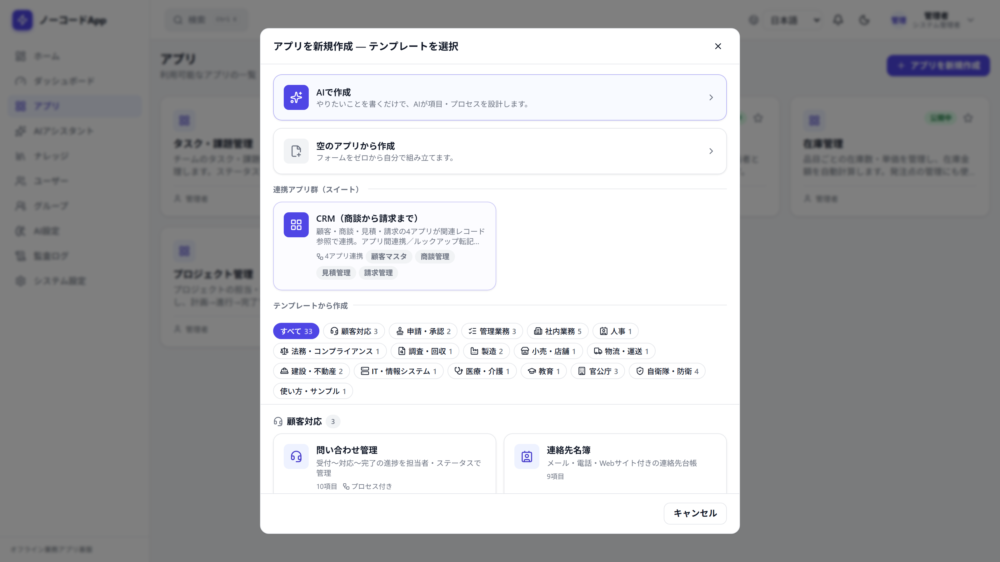

<div align="center">

# ノーコードApp

**LAN内・オフライン環境でも動く、自分たちで持てる業務アプリ基盤**

フォーム・一覧・権限・ワークフロー・ダッシュボード・監査ログ・LLM連携を、コードを書かずに。

[](https://github.com/momomo17svt-dev/nocode-app/actions/workflows/ci.yml)
[](https://github.com/momomo17svt-dev/nocode-app/actions/workflows/codeql.yml)
[](LICENSE)
[](.nvmrc)
[](docs/setup-guide.md)

[English](README.en.md) ・ [セットアップ](docs/setup-guide.md) ・ [画面](#画面) ・ [ドキュメント](#ドキュメント) ・ [変更履歴](CHANGELOG.md) ・ [貢献する](CONTRIBUTING.md)

<br>



</div>

---

社内の業務アプリを、外部SaaSに預けずに自分たちのサーバーで動かすための基盤です。インターネットに出られない閉じたネットワークでも、Dockerが動くPC1台あれば立ち上がります。

> [!IMPORTANT]
> 現在は公開準備中の `v0.1.0` です。インターネットへ直接公開する前に [SECURITY.md](SECURITY.md) と [既知の課題](docs/known-issues.md) を確認してください。

## 何ができるか

| | |
| --- | --- |
| 🧩 **アプリ作成** | 22種類の項目を並べるだけでフォーム・一覧・詳細画面ができます。33種類の業務テンプレートと、CRM連携アプリ群のセットからも始められます |
| 📊 **6つの見せ方** | 一覧・ボード・カレンダー・地図・進捗・グラフを切り替えられます。絞り込み条件と並び順は保存ビューとしてチームで共有できます |
| 🧮 **計算** | 四則演算、条件分岐（ルール表）、明細テーブルの集計（`sum` `avg` `count`）をノーコードで定義できます |
| 🔐 **権限** | 部署ツリー、レコードの公開範囲（全社／自分のみ／所属部署）、対象社員フィールド基準の絞り込みに対応します |
| 🔁 **ワークフロー** | 状態遷移と承認者の指定、差戻し経路を設定できます。承認は指定された本人だけが実行できます |
| 📈 **ダッシュボード** | KPI・グラフ・一覧・地図・自分のタスクをウィジェットとして配置し、共有範囲を選べます |
| 🗂 **監査と復旧** | 全操作の監査ログ、削除後30日以内のレコード復元、更新時のバージョン照合による上書き防止 |
| 🤖 **AI連携（任意）** | ローカルLLM（LM Studio・Ollama）でも、クラウドのOpenAI互換APIでも動きます。参照範囲は既定で「なし」 |
| 🌐 **多言語** | 画面は日本語と英語を切り替えられます。日付・時刻・数値も選択言語に追従します |
| 📡 **オフライン前提** | 外部への通信なしで完結します。地図もタイルをローカルに置けばオフラインで表示できます |

## 画面

<table>
<tr>
<td width="50%">

<sub><b>レコード一覧</b> — 一覧・かんばん・カレンダー・進捗・集計グラフをタブで切り替え。「在庫金額」は単価×在庫数の計算フィールドです。</sub>
</td>
<td width="50%">

<sub><b>かんばん</b> — 任意の選択項目で列を組み、カードをドラッグして値を更新できます。</sub>
</td>
</tr>
<tr>
<td width="50%">

<sub><b>フォーム設定</b> — 22種類の項目を左から追加し、並べ替えてフォームを組み立てます。</sub>
</td>
<td width="50%">

<sub><b>テンプレート</b> — 33種類の業務テンプレートと、4アプリが連携するCRMスイートから始められます。</sub>
</td>
</tr>
</table>

## クイックスタート

### Docker（推奨）

Docker Desktop を起動してから実行します。

```text
start_docker.bat
```

初回はランダムなDBパスワード・JWT秘密鍵・管理者パスワードを生成し、管理者情報を**一度だけ**画面に表示します。起動後は <http://localhost:5173> を開いてください。

停止とログ確認には `stop_docker.bat` と `logs_docker.bat` を使います。

<details>
<summary>Windows以外・手動で起動する場合</summary>

`.env.example` を `.env` へコピーし、`change_me` の値をすべて変更してから実行します。

```bash
docker compose up -d --build
```

</details>

### Windows・Dockerなし

**PostgreSQL本体はリポジトリに含まれません。** ポータブル版を使う場合は各自で入手して `pgsql/` へ展開するか、`NOCODEAPP_PG_HOME` で場所を指定します。入手先は[セットアップガイド](docs/setup-guide.md)にあります。

```text
setup.bat
start_server.bat
```

`setup.bat` は環境設定と初期管理者を安全に生成し、DBマイグレーションとビルドを行います。

> [!NOTE]
> Docker版とbat版は同じ5173番ポートを使うため、同時には起動しないでください。

### 動作要件

| | |
| --- | --- |
| Node.js | 22 以上 |
| PostgreSQL | 16 以上 |
| Docker | Docker版を使う場合のみ |

## 主な技術

| 層 | 構成 |
| --- | --- |
| Backend | NestJS 11 / Prisma 7 / PostgreSQL / JWT（HttpOnly Cookie） |
| Frontend | React 19 / TypeScript / Vite / Tailwind CSS |
| Storage | ローカル添付ファイル、任意のオフライン地図タイル |
| AI（任意） | LM Studio、Ollama、OpenAI、OpenRouter、Groq、Gemini、Mistral、任意のOpenAI互換API |

## AI連携（任意）

管理画面からプロバイダー、ベースURL、チャットモデル、埋め込みモデルを設定できます。クラウド接続ではAPIキーも登録できますが、保存済みのキーは画面や設定APIへ再表示されません。AI検索を使う場合は、接続先が埋め込みAPIにも対応していることを確認してください。

<details>
<summary><b>AIアシスタントの参照範囲</b> — 既定は「参照なし」です</summary>

<br>

AIチャットは初期状態で「参照なし」です。通常の会話だけを行い、アプリデータやナレッジを自動参照しません。質問前に、次の参照範囲へ明示的に切り替えられます。

| 参照範囲 | 動作 |
| --- | --- |
| 参照なし（通常チャット） | チャットモデルだけを使用 |
| アプリデータのみ | 閲覧権限のある全アプリ、または選択した1アプリを検索 |
| ナレッジのみ | 閲覧可能な全文書、または選択した1文書を検索 |
| アプリデータ＋ナレッジ | 両方を横断検索 |

参照範囲を変更すると、以前の出典が次の回答へ混ざらないよう新しい会話になります。検索を伴う3モードには埋め込みモデルが必要です。関連情報が十分に見つからない場合、AIに推測させず参照範囲や質問条件の見直しを案内します。「ナレッジ」画面は文書の閲覧・管理に専念し、「AIに質問」から対象文書を選択した状態のAIアシスタントへ移動できます。

</details>

<details>
<summary><b>ナレッジの公開範囲</b> — 部署単位で絞り込めます</summary>

<br>

ナレッジ文書は「全社」または複数の「部署」へ公開できます。部署を指定した場合は、選択部署だけに限定するか、その配下部署まで含めるかを文書ごとに選択できます。文書一覧・本文表示・AI検索はいずれも同じ部署権限で絞り込まれるため、参照できない部署の文書がAIの回答根拠に混ざることはありません。

旧バージョンでアプリ権限に紐付けた文書は、移行時に「従来のアプリ権限」としてそのまま保護されます。管理者が文書を編集して「全社」または「部署」へ変更した時点で、新しい公開範囲へ移行します。

</details>

## 管理者向け運用機能

左メニューの「システム設定」では、次の項目をGUIで管理できます。

- ログイン失敗回数、一時ロック時間、ログイン保持時間、パスワード最低文字数
- DBの自動バックアップ、手動実行、世代一覧・ダウンロード
- 外部連携用APIトークンの発行・無効化
- 削除後30日以内のレコード復元・完全削除

ユーザーの無効化、権限変更、パスワード変更は既存セッションへ即時反映されます。レコード更新にはバージョン照合が入り、複数人が同じ古い画面から更新した場合の意図しない上書きを防止します。外部連携は[API連携ガイド](docs/api-integration.md)を参照してください。

## データとバックアップ

- DockerのDBは名前付きボリュームへ保存されます。
- bat版のDBは指定したPostgreSQLデータディレクトリへ保存されます。
- 添付ファイルは `storage/attachments/` へ保存されます。
- システム管理者は「システム設定」からDBの毎日自動バックアップ、実行時刻、保存日数を設定できます。ダンプは `storage/backups/` へ保存されます。
- DBダンプ、添付、環境設定、地図キャッシュはGit管理対象外です。

別PCへフォルダごと移す前に `export-db.bat` を実行してください。Docker版とbat版を自動判定して `migration/nocode_db.sql` を作成し、移行先の新規Dockerまたは `setup.bat` から復元できます。復元の確認方法は[バックアップ・復元ガイド](docs/backup-restore-guide.md)に、本番データの移動は[オフライン移行ガイド](docs/offline-migration.md)にまとめています。

## 表示言語

画面上部またはログイン画面の言語選択から、日本語と英語を切り替えられます。選択した言語はブラウザごとに保存され、次回起動時にも維持されます。日付・時刻・数値表示も選択言語に合わせて切り替わります。アプリ内に登録したレコード本文などの業務データは自動翻訳されません。

画面文言を追加・変更した場合は、`frontend/` で `npm run i18n:audit` を実行すると、英訳が未登録の日本語を検出できます。CIでも同じ検査が走ります。

## 開発

```bash
cd backend
npm ci
npm run build
npm test -- --runInBand
npm run test:e2e

cd ../frontend
npm ci
npm run build
npm test
```

Pull Requestでは、両方の `lint`・`build`・単体テスト、実PostgreSQLを使うE2E、DBバックアップ復元試験、CodeQL走査、依存関係監査が自動実行されます。詳しくは [CONTRIBUTING.md](CONTRIBUTING.md) を参照してください。

## ドキュメント

| 文書 | 内容 |
| --- | --- |
| [セットアップ手順書](docs/setup-guide.md) | Windows bat版の導入、PostgreSQLの用意 |
| [Docker起動ガイド](docs/docker-guide.md) | Docker版の起動・停止・トラブル対応 |
| [バックアップ・復元ガイド](docs/backup-restore-guide.md) | 自動／手動バックアップと復元の確認方法 |
| [オフライン移行](docs/offline-migration.md) | 本番データを別PCへ移す手順 |
| [API連携ガイド](docs/api-integration.md) | 外部連携用トークンとエンドポイント |
| [アーキテクチャ設計](docs/architecture.md) | 全体構成と主要な設計判断 |
| [データベース設計](docs/db-design.md) | テーブル構成とインデックス |
| [権限モデル設計](docs/permission-design.md) | アプリ権限・レコード公開範囲・部署ツリー |
| [セキュリティ設計レビュー](docs/security-review.md) | 認証、CSRF、アップロード、ヘッダー |
| [既知の課題・制約](docs/known-issues.md) | 未対応の仕様と回避策 |
| [テスト計画](docs/test-plan.md) | 検証範囲と自動テストの構成 |
| [実装ウォークスルー](docs/walkthrough.md) | 主要な処理の読み方 |

## 地図データ

地図タイル本体はリポジトリに含まれません。配信元ごとの利用規約、出典表示、複製・使用手続を確認してください。特に `tile.openstreetmap.org` のタイルはオフライン用一括取得に使用できません。

## 貢献とセキュリティ

- 開発の進め方は [CONTRIBUTING.md](CONTRIBUTING.md)、行動規範は [CODE_OF_CONDUCT.md](CODE_OF_CONDUCT.md) にあります。
- 脆弱性は公開Issueではなく [SECURITY.md](SECURITY.md) の手順で報告してください。

## ライセンス

ソースコードは [MIT License](LICENSE) で公開します。地図、PostgreSQL、各npm依存関係など第三者の成果物にはそれぞれの条件が適用されます。[THIRD_PARTY_NOTICES.md](THIRD_PARTY_NOTICES.md) も確認してください。
